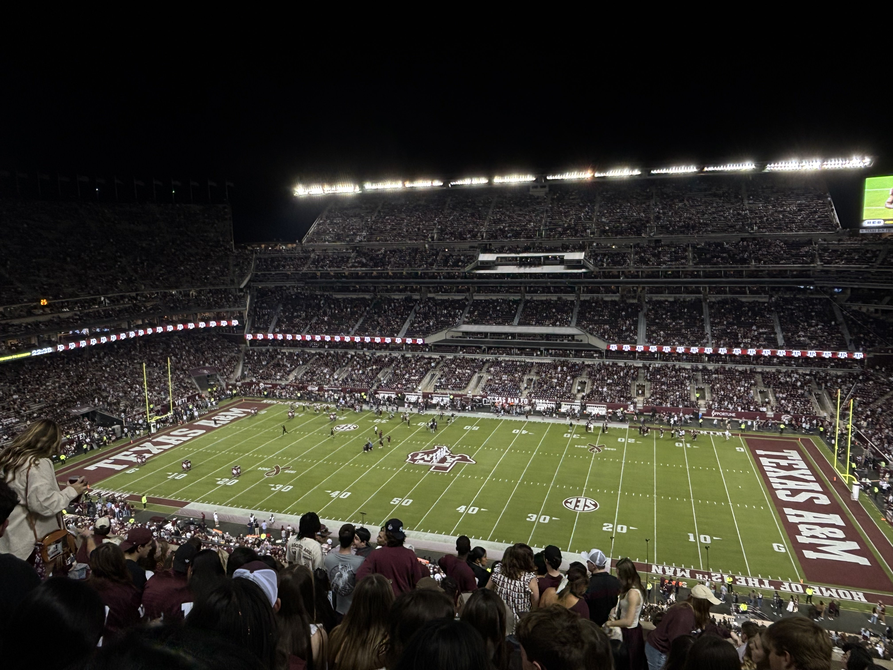

<table>
  <tr>
    <td></td>
    <td></td>
  </tr>
</table>

<h1 align="center">Hello 👋, I'm Anant Mehta</h1>
<h3 align="center">I am currently working on Self-Supervised Bimodal Representation Learning !!</h3>

  

- 💻 I’m looking to collaborate on **Foundation Model Training**

- 🤝 I’m looking enhance my skills in **Stochastic and Compositional Optimization in ML**

- 📫 How to reach me **anant_mehta@tamu.edu**

<h3 align="left">Connect with me:</h3>

<h3 align="left">Everyday Tools :-)</h3>

   

<h3 align="left">Gameday Clicks:</h3>

  
  

